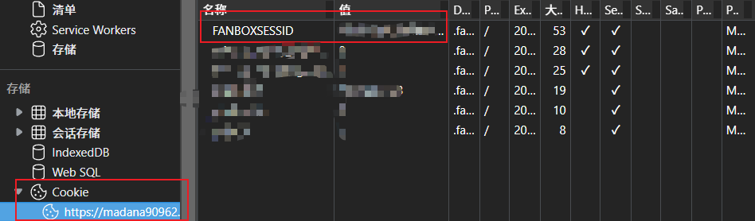

# Fanbox Get

1. you need login a fanbox account, and pay for non-free posts.
2. open **Developer Tools** > **Application** > **Cookie** > **xxx.fanbox.cc** , and record the `FANBOXSESSID`'s value.
    
3. set environment variable `FANBOXSESSID=<value>`.
4. install [Tampermonkey](https://www.tampermonkey.net/) and install the script [javascript/fanboxparse.js](javascript/fanboxparse.js) , then, when you open a post page, it will appear a 下载 button nearby the Like button.
    
5. click 下载, then the download info json text will be saved in clipboard.
6. write then to `download.json` and runs `fanboxget download.json`.
